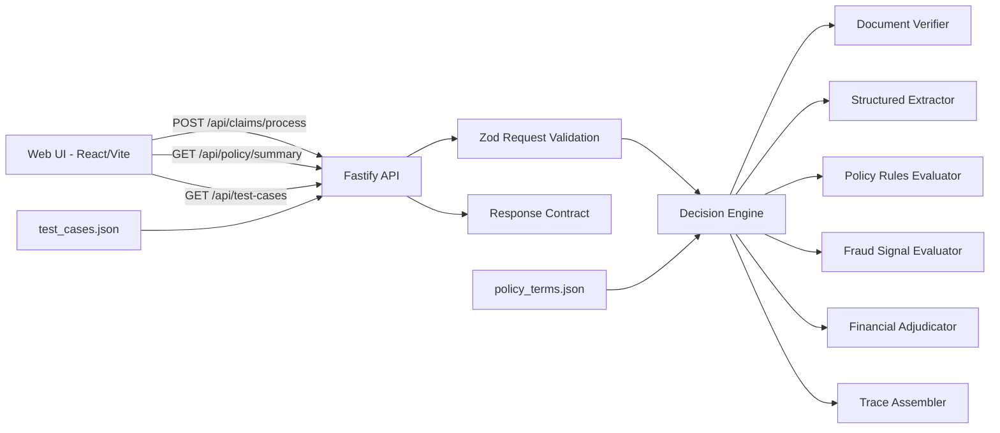

# Architecture Overview

## System Summary

This system is a policy-driven, explainable claim adjudication platform with three layers:

1. `Decision Engine` (core domain logic)
2. `API Service` (Fastify transport, validation, contracts)
3. `Web Console` (submission + explainability UI)

The design prioritizes deterministic policy behavior, complete traceability, and graceful degradation under component failure.

## High-Level Flow

1. User submits claim payload (JSON/API/UI).
2. API validates payload schema with Zod.
3. Engine runs staged processing:
   - member validation
   - document requirement gate (early stop)
   - document readability and cross-document consistency checks
   - extraction stage (with simulated/real failure handling)
   - policy rule checks (waiting periods, exclusions, pre-auth, limits)
   - fraud signals and manual-review routing
   - financial computation (network discount before copay)
4. Engine returns:
   - decision (`APPROVED`, `PARTIAL`, `REJECTED`, `MANUAL_REVIEW`, or blocked pre-decision)
   - approved amount
   - confidence score
   - reasons
   - full explainability trace
5. UI renders decision summary, line-item adjudication, and full trace timeline.

## Component Topology

## Explainability Strategy

Each major stage emits a `trace` entry:

- `step`: deterministic stage identifier
- `status`: `PASS` | `FAIL` | `WARN` | `INFO`
- `message`: human-readable explanation
- `data` (optional): structured evidence

This allows operations to reconstruct exactly why a decision occurred.

## Resilience Strategy

- Document and extraction failures do not crash the pipeline.
- The system degrades with:
  - warning trace entries
  - reduced confidence score
  - manual-review recommendation in message/metadata
- Input errors return clear contract-level responses (400 with details).

## Why This Design

- Deterministic policy evaluation improves reliability and auditability.
- Strict stage boundaries reduce coupling and simplify testing.
- Trace-first outputs satisfy explainability requirements by default.
- API and engine separation allows future replacement of extraction with LLM/vision providers without rewriting policy logic.

## Trade-offs

- Current extraction is simulated/heuristic from structured input; production OCR/vision adapters should be plugged into extractor stage.
- State is currently file-backed for policy and test fixtures; production should externalize to policy service + versioned config store.
- Fraud model is threshold-based; future version should use probabilistic features and behavioral history datastore.

## Scale Plan (10x)

1. Move policy and member data to low-latency database + cache.
2. Make extraction asynchronous with queue workers and retries.
3. Introduce idempotent claim-processing IDs and event sourcing.
4. Split decision engine into independently deployable services if throughput requires.
5. Add OpenTelemetry traces + metrics (latency, error rates, decision distribution).
6. Add rule versioning to replay historical decisions exactly.
